# User Flow Diagrams - E-Action Auction Hub

**Generated:** 2026-02-12  
**Project:** E-Action - Real-Time Auction Platform

---

## Table of Contents
1. [Current Registration Flow](#current-registration-flow)
2. [Current Login Flow](#current-login-flow)
3. [Current Protected Route Flow](#current-protected-route-flow)
4. [Ideal Registration Flow](#ideal-registration-flow)
5. [Ideal Login Flow](#ideal-login-flow)
6. [Ideal Protected Route Flow](#ideal-protected-route-flow)
7. [Password Reset Flow (Missing)](#password-reset-flow-missing)
8. [Email Verification Flow (Missing)](#email-verification-flow-missing)

---

## Current Registration Flow

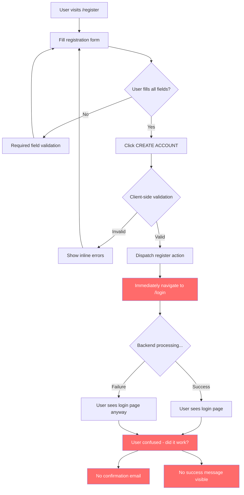

### Problems Identified:
- ❌ **Navigates before registration completes** (Line 99)
- ❌ **No success confirmation shown**
- ❌ **No email verification**
- ❌ **User doesn't know if registration succeeded**
- ❌ **Toast message may not be visible**
- ❌ **No welcome email sent**

---

## Current Login Flow

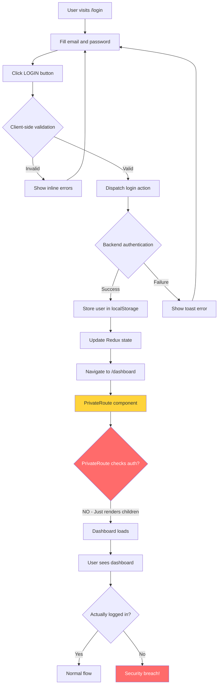

### Problems Identified:
- ❌ **PrivateRoute does nothing** (Critical security flaw)
- ❌ **No session validation**
- ❌ **Anyone can access dashboard by typing URL**
- ❌ **No loading state during login**
- ❌ **No "Remember Me" option**

---

## Current Protected Route Flow

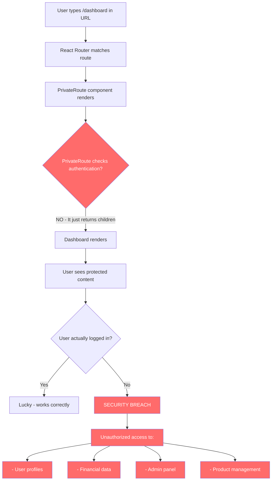

### Critical Security Flaw:
```jsx
// Current implementation (BROKEN)
export const PrivateRoute = ({ children }) => {
  return <div>{children}</div>;  // ❌ NO PROTECTION
};
```

---

## Ideal Registration Flow

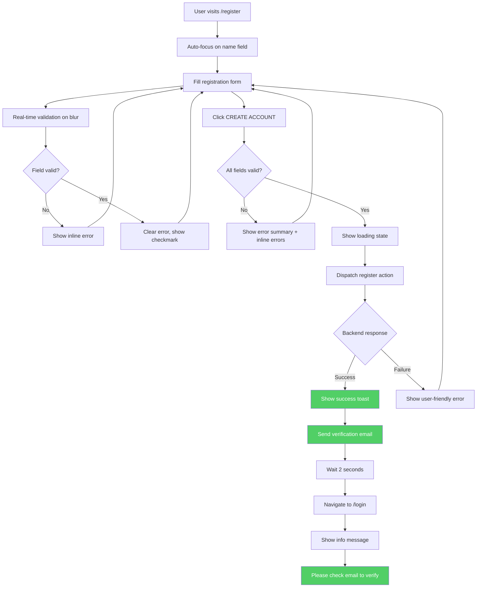

### Improvements:
- ✅ **Auto-focus for better UX**
- ✅ **Real-time validation**
- ✅ **Visual feedback (checkmarks)**
- ✅ **Wait for completion before redirect**
- ✅ **Success confirmation**
- ✅ **Email verification**
- ✅ **Clear next steps**

---

## Ideal Login Flow

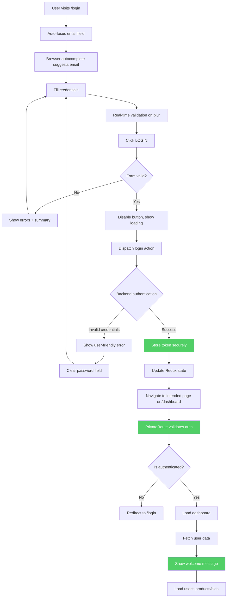

### Improvements:
- ✅ **Proper authentication flow**
- ✅ **Loading states**
- ✅ **User-friendly errors**
- ✅ **Security validation**
- ✅ **Welcome message**
- ✅ **Remember intended destination**

---

## Ideal Protected Route Flow

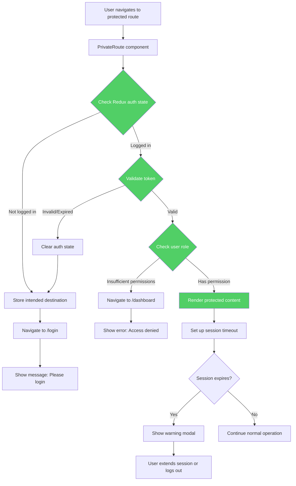

### Security Features:
- ✅ **Authentication check**
- ✅ **Token validation**
- ✅ **Role-based access control**
- ✅ **Session timeout handling**
- ✅ **Intended destination preservation**

---

## Password Reset Flow (Missing - Needs Implementation)

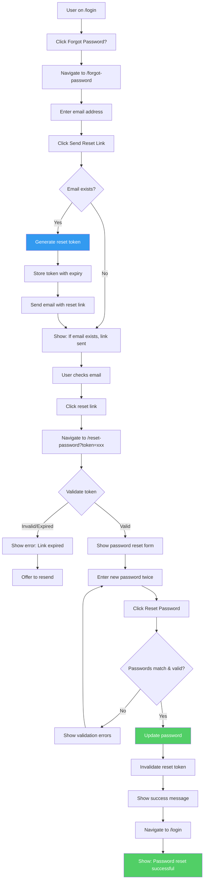

### Required Implementation:
1. ✅ Forgot password page
2. ✅ Backend API for token generation
3. ✅ Email service integration
4. ✅ Reset password page
5. ✅ Token validation logic
6. ✅ Password update endpoint

---

## Email Verification Flow (Missing - Needs Implementation)

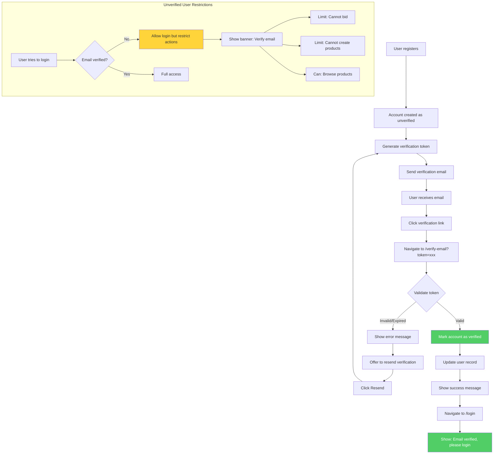

### Required Implementation:
1. ✅ Email verification endpoint
2. ✅ Verification email template
3. ✅ Verification page
4. ✅ Resend verification option
5. ✅ Unverified user restrictions
6. ✅ Verification status banner

---

## Complete User Journey Map

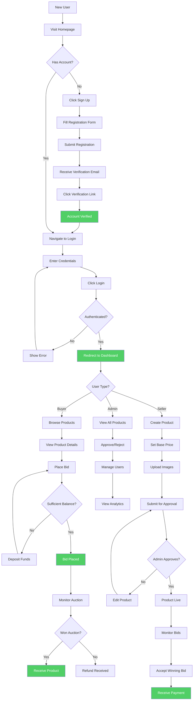

---

## Navigation Flow Issues

### Current Duplicate Routes Problem

```mermaid
graph TD
    A[User Profile Component] --> B[/dashboard/profile]
    A --> C[/profile]
    
    D[User List Component] --> E[/dashboard/users]
    D --> F[/userlist]
    
    G[Winning Bids Component] --> H[/dashboard/winning-bids]
    G --> I[/winning-products]
    
    J[Category List Component] --> K[/dashboard/categories]
    J --> L[/category]
    
    M[Internal Links] --> N{Which route to use?}
    N --> O[Confusion]
    N --> P[Broken links]
    N --> Q[SEO issues]
    
    style O fill:#ff6b6b,color:#fff
    style P fill:#ff6b6b,color:#fff
    style Q fill:#ff6b6b,color:#fff
```

### Recommended Single Route Structure

```mermaid
graph TD
    A[Dashboard] --> B[/dashboard]
    B --> C[/dashboard/profile]
    B --> D[/dashboard/my-products]
    B --> E[/dashboard/create-product]
    B --> F[/dashboard/winning-bids]
    B --> G[/dashboard/wallet]
    B --> H[/dashboard/users - Admin]
    B --> I[/dashboard/categories - Admin]
    
    J[Public Routes] --> K[/]
    J --> L[/login]
    J --> M[/register]
    J --> N[/forgot-password]
    J --> O[/reset-password]
    J --> P[/verify-email]
    J --> Q[/details/:id]
    
    style B fill:#51cf66,color:#fff
    style J fill:#51cf66,color:#fff
```

---

## Error Handling Flow

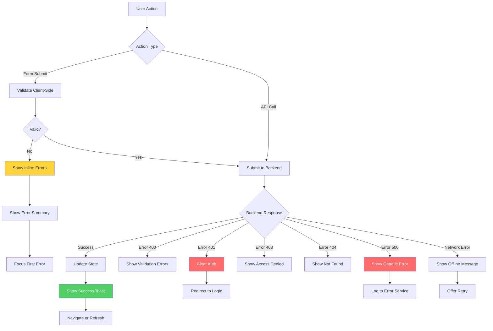

---

## Session Management Flow

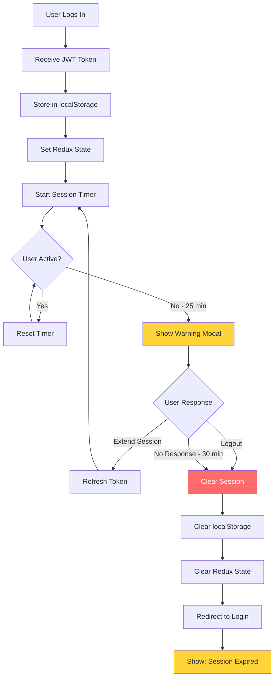

---

## Summary of Flow Issues

### Critical Flow Problems:
1. ❌ **No authentication protection** - PrivateRoute is non-functional
2. ❌ **Registration redirects too early** - No confirmation
3. ❌ **No password reset** - Users get locked out
4. ❌ **No email verification** - Security risk
5. ❌ **Duplicate routes** - Confusing navigation

### Recommended Flow Improvements:
1. ✅ Implement proper PrivateRoute with auth checks
2. ✅ Add password reset flow
3. ✅ Add email verification flow
4. ✅ Remove duplicate routes
5. ✅ Add loading states throughout
6. ✅ Add error boundaries
7. ✅ Implement session timeout
8. ✅ Add breadcrumb navigation
9. ✅ Improve error handling consistency
10. ✅ Add user feedback at every step

---

**Report Generated By:** Antigravity AI  
**Date:** 2026-02-12  
**For:** E-Action Auction Hub User Flow Analysis
